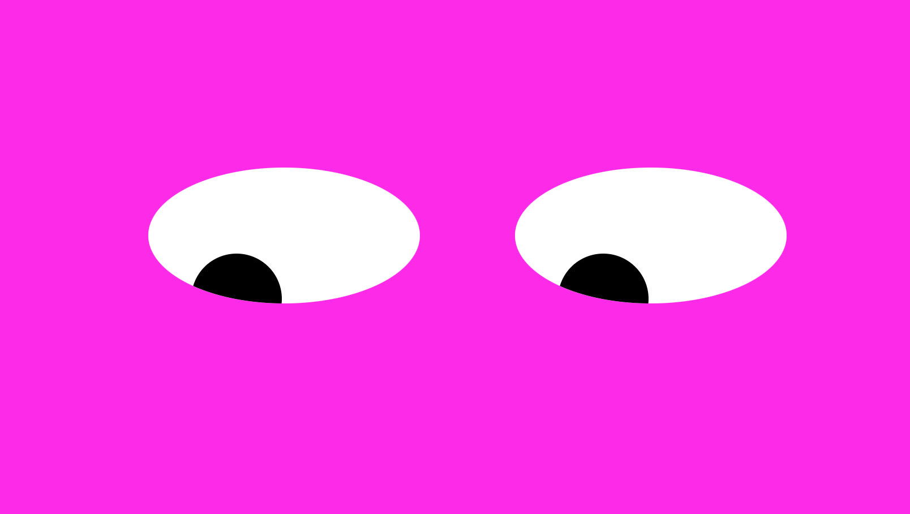

# EyeMovement
## Description
Move your mouse around the page to watch the eyes track the movement. An exercise on CSS. 

## How to Run
Simply move you mouse around the page and watch the 'eyes' follow. 

## Roadmap 
Styling and adding new visual elements. 

## Visual 

## [License](https://choosealicense.com/licenses/mit/)
